# shopping-data-excel

Analysis of a shopping dataset using excel

## Introduction
The goal of this project is to apply the Excel skills I have been learning over the past month, by documenting my analysis of a shopping dataset that the organization I am learning from has provided. :smile:

## Problem Statement
The marketing department aims to launch a campaign in the second quarter of 2024. However, they require a dashboard to monitor business activity during the waiting period. This will provide insights into where to channel the campaign efforts. The Marketing lead would like to track various metrics over time, including product performance, changes in customers' choice of color, location, and seasonality patterns in relation to orders. Additionally, any other metric(s) deemed necessary should be incorporated into the dashboard.

## Tools, skills and concepts used
- Excel
- Formulas and Functions
- Pivot Tables
- Dashboard Building

## Data Cleaning
The first step I took was is to ensure that my data is clean enough for use, this is to ensure that my analysis is void of error and the results are more reliable. The steps I took to clean the data are stated below:

### Step 1
Remove duplicates: I used the excel remove duplicates tool in the data tab to do this. It was realized that there 9 duplicates in the dataset, which could have resulted from error when inputting the values. 
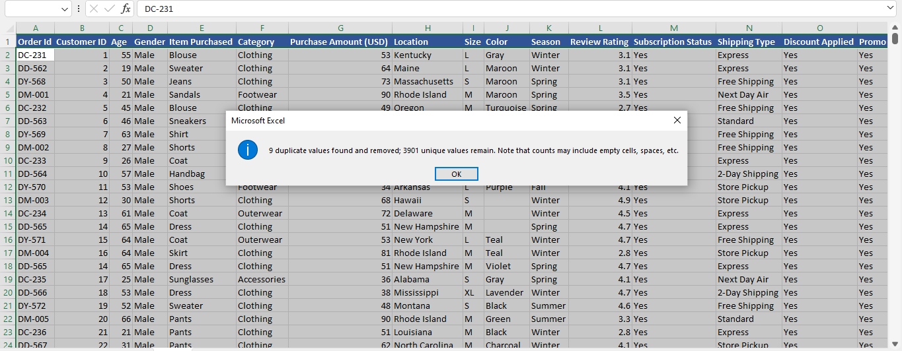

### Step 2
Missing Values: I noticed that there were about 10 missing values in the customer ID column, also they all followed each other which brought me to the conclusion that it was probably manually altered. So it was very easy to rectify. I used Flash fill to fill the empty columns because the follow an order.
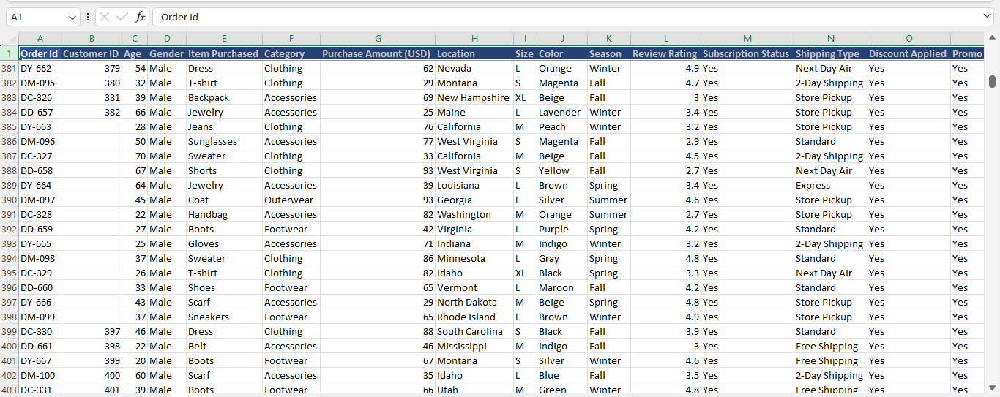

There were also some missing values in the colour column of the dataset. Since this is a categorical data, I filled the blank cells with “UNKNOWN”, using the find and replace feature in excel. This was done to minimise errors in the analysis
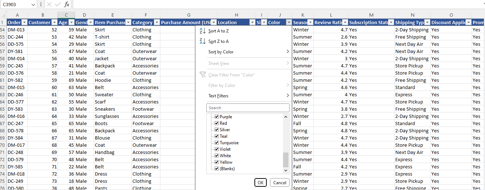

### Step 3
Input Errors: There were some worngly inputed values, I came to this conclusion because of some unrealistic ages in the age column, '280' and '3100' to be specific. I corrected this by adjusting the numbers manually to be 28 and 31. 
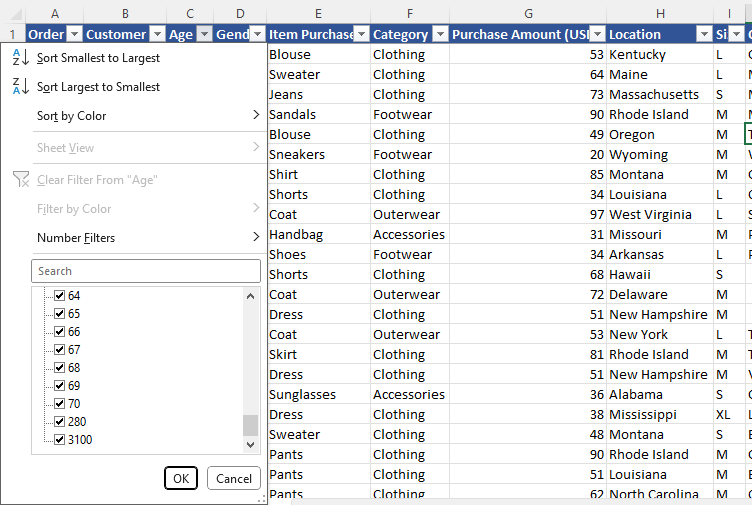

### Step 4
Incorrect categorical data: There were some incorrect values in the colour column of the dataset. The incorrect values were different variations of what is meant to spell “BLACK” but the error could have risen from human input error. So I just corrected them manually as they were not much
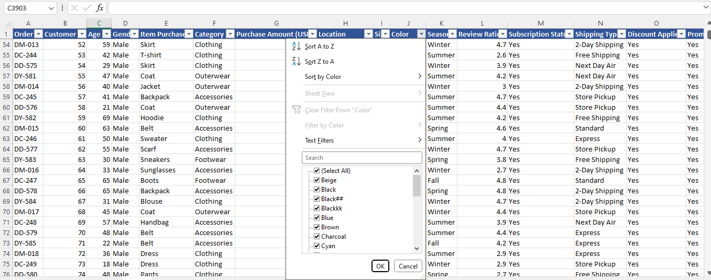

### Step 5 
Multiple naming structure: In the category column of the dataset. I noticed that footwear category was written in 2 different forms i.e “Foot Wear” and “Footwear”. So I just ensured that they were in the same format
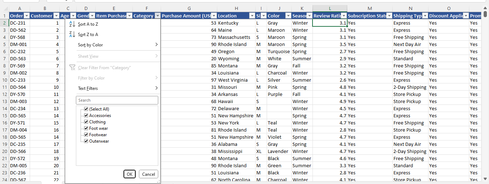

## Analysis
The total number of rows in the dataset is 3901 which can be referred to as the number of transactions that was recorded. From the Purchase Amount (USD) column it was discovered that the total amount processed from all 3901 transactions was $ 231,132 (Two Hundred and thirty-one thousand, one Hundred and thirty-two) dollars. 
In relation to the problem statement, I began my analysis using the Pivot tables

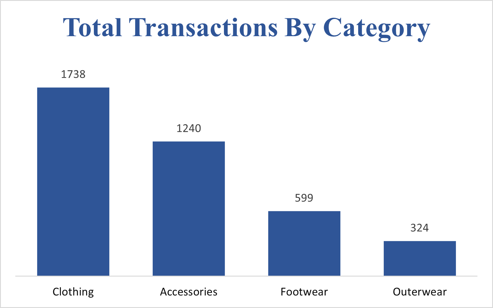
The highest selling category according to the dataset is the clothing category with a total of 1738 transactions and the least performing category is the Outerwear category with a total sale of 324 transactions. This could be as a result of many factors, one of which includes that clothing is more essential than outer wears regardless of the weather condition, Outer wears are more of a necessity during the winter season, so many people might not have need of them until during the winter season

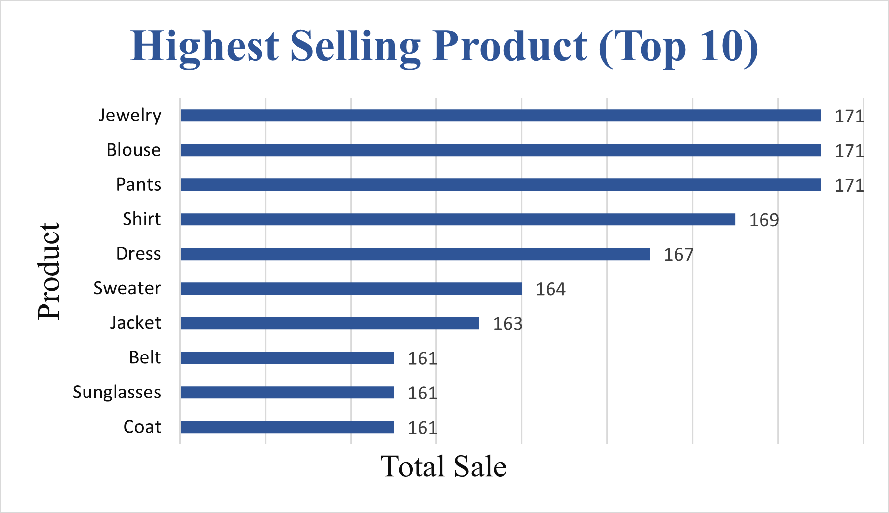
The Highest selling products are displayed above and blouses are the highest, but not by much of a margin. So it is obvious from the chart that many of the highest selling products e.g sunglasses, shorts, scarf, dress, blouse, shirt, sweater etc are clothing materials that used during the Fall, spring and summer season 

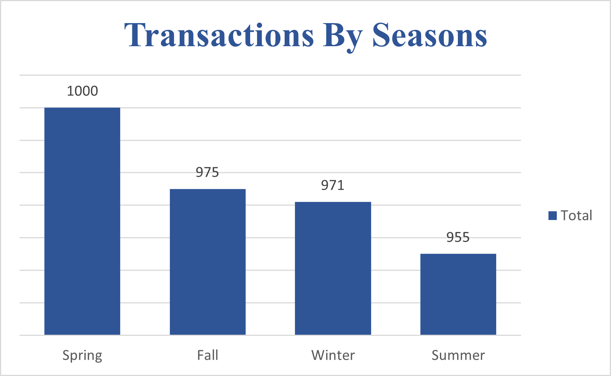
Analyzing the total sales made by season, the data shows that the highest number of transactions occurs during the Spring season with a total transaction of 1000 and the lowest number of transactions being recorded in the summer with a total transaction of 955.

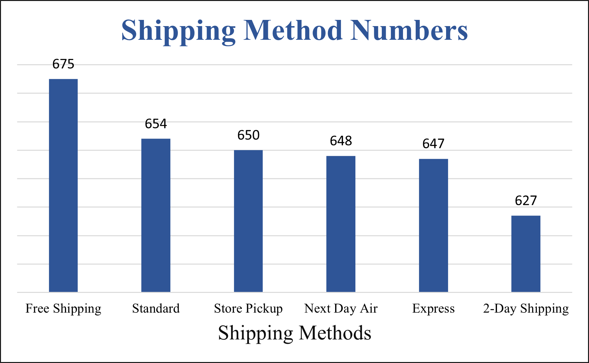
Now looking at the method of delivery, from the chart, we can see how many transactions are done by each of the delivery methods. Although the margin is not much, more people tend to make transactions using the free shipping option. The free shipping option has the highest number of transactions with a total of 675. While the least used shipping method is the 2-Day shipping method with the number of transactions equaling 627. 

### Results
From the analysis, I was able to create a dashboard that would help the marketing team monitor previous business activities, and also help them know where to channel their efforts into driving profit and sales for the company.

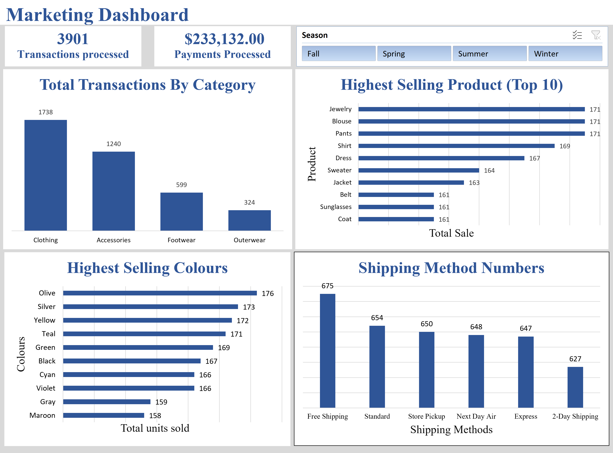
The dashboard contains metrics that I believe are vital to helping the marketing team, such as the Total Sales By Category, Top 10 Total Sales By Product, Highest Selling Colours, Shipping methods. And I added a slicer which helps us know how each of these performed in different seasons.

So from these we see that we have the highest number of transactions during the Spring season, but the highest number of processed payments during the Fall season. This could be an indication that during the Fall season things could be more expensive. This and many other insights can be drawn from the dashboard. 

This is where I would end my analysis of the dataset. My recommendation to the marketing team would be to focus their campaign on driving sales during the fall season and also they could make more availability to the Free shipping  mode of delivery especially during the winter season to drive up sales during the winter. 
